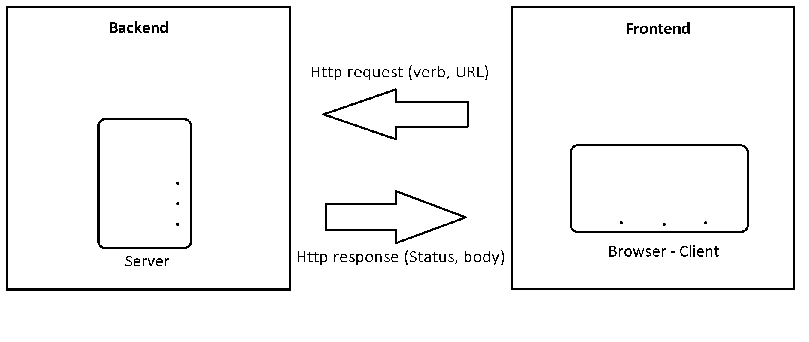

# Movies-Library-2
This is a **REDO** of the first attempt that didn't run properly for unidentified reasons
# Movies-Library - 2

**Author Name**: Mu'ayad Al Shareef

## WRRC

## Overview
Given adequate data related to a movie, this project aims to construct a review profile for said movie in an easily readble form.

## Getting Started
1. Draw the web request response cycle for the task at hand

2. Set up your server repository:

- Create a repository called Movies-Library on GitHub
- Initialize your project by running the following command "npm init -y"
- Create a new branch called Task11
- Create basic file structure (server.js, .gitignore, .eslintrc.json )
- Install the required packages for this task: npm install express cors

3. Build the following routes using the GET request:

- Home Page Endpoint: /

    - reate a route with a method of get and a path of /. The callback should use the provided JSON data.
    - Create a constructor function to ensure your data follow the same format.

## - Project Features -

# Progress report
| Day      | Progress |
| ----------- | ----------- |
| 11      | May-27th: Server initialization, further work pending.       |
|12    | Connecting to a 3rd party API,         |
|13    |         |
|14    |         |
|15    |         |
|16    |         |
|17    |         |
|18    |         |